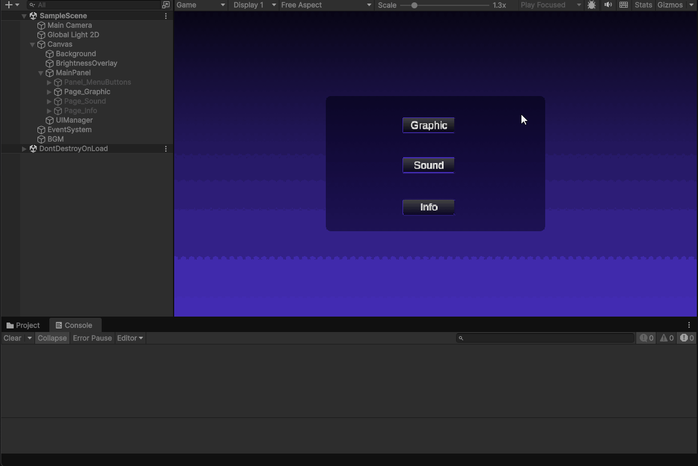

# Unity Sound Settings UI – Functional UGUI Mini Project  



🎧 A minimal but functional sound settings UI built with Unity UGUI.

Unity로 “작동하는 UI”를 직접 설계한 미니 프로젝트입니다.  
슬라이더 값 반영, 상태 표시, 버튼 이벤트 등 UI의 핵심 구조를 단순한 튜토리얼이 아닌 기능 중심 설계로 구현했습니다.

---

## 🎯 Project Goals

- Build a lightweight yet functional UI using Unity UGUI  
- Connect UI components through **event-driven logic**  
- Update UI state (volume text, slider values) in real time  
- Maintain clean and readable C# scripts  
- Provide a minimal but extensible settings panel structure  

---

## 🧩 Features

### ✔ Volume Slider (Master Volume)
- Real-time percentage update  
- `OnValueChanged` event-based callback  
- Extensible to AudioMixer / AudioSource  

### ✔ Functional Buttons
- Reset to default volume  
- Apply/Confirm logic prepared  
- Inspector-based event wiring  

### ✔ UI/UX Structure
- Organized hierarchy of Panels, Images, Sliders, and Text  
- Clean layout for desktop & mobile  
- TextMeshPro for sharp UI rendering  

---

## 🧠 Key Script: `SoundPageController.cs`

Handles UI interaction and state updates.

### Volume Update Example
```csharp
public void OnVolumeChanged(float value)
{
    int percent = Mathf.RoundToInt(value * 100f);
    volumeText.text = percent + "%";
}

### Reset Function Example
```csharp
public void ResetVolume()
{
    volumeSlider.value = defaultVolume;
    OnVolumeChanged(defaultVolume);
}
```

Focused on **clarity, maintainability, and modular event-driven UI logic**.

---

## 📁 Project Structure

```
Assets/
  Audio/
  Background.png
  Btn_CloseGraphic.png
  button.png
  panel.png
  Scenes/
    SampleScene.unity
  Scripts/
    SoundPageController.cs
  Settings/
  TextMesh Pro/
```

---

## ▶ How to Run

1. Open the project in **Unity 2021+**
2. Load the scene:

   ```
   Assets/Scenes/SampleScene.unity
   ```
3. Press **Play** and interact with the UI

---

## 🚀 Future Improvements

* AudioMixer support  
* Additional pages (Graphics / Gameplay / Info)  
* UI animations & transitions  
* JSON save/load system  
* Mobile-responsive UI improvements  

---

## 🧑‍💻 Author

**Eunseo Heo (esheo-skia)**<br>
*Software Developer — Imaging Tools & Automation*

* **Contact:** [heunseo1787@gmail.com]
* **GitHub:** [https://github.com/esheo-skia]

---

## 📌 Summary

A clean, functional UI demo showcasing how to build  
**event-driven, production-ready interface systems** in Unity.
